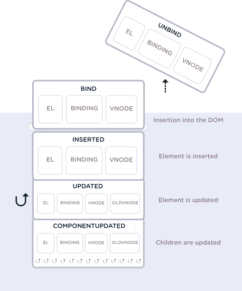

# Custom directives

https://css-tricks.com/power-custom-directives-vue/

#### Содержание

[[toc]]

---


### Global register
```js
Vue.directive('tack', {
  bind(el, binding, vnode) {
    el.style.position = 'fixed'
  }
});
```

### Local register
```js
import Tack from './custom/directives/tack'
export default {
  directives: {
    Tack
  }
}
```

### Using
```html
<div v-tack>...</div>
```

### Hooks (Этапы)
Для нас доступно несколько этапов на которых мы можем работать, и каждый из них имеет несколько аргументов. Этапы следующие:
* **bind** - Это происходит, когда директива прикреплена к элементу.
* **insert** - этот крючок возникает после того, как элемент вставлен в родительский DOM.
* **update** - этот hook вызывается, когда элемент обновляется, но дети еще не обновлены.
* **componentUpdated** - этот хук вызывается, когда компонент и дети были обновлены.
* **unbind** - этот hook вызывается после удаления директивы.




### Params 
Так же можно передавать параметры в директиву. У директивы 3 основных параметра:
* `el` - сам обьект,
* `binding` - параметры, 
* `vnode` - dom element

```html
<p v-tack="90">Stick me 70px from the top of the page</p>
```

```js
Vue.directive('tack', {
  bind(el, binding, vnode) {
    el.style.position = 'fixed'
    el.style.top = binding.value + 'px' // <!-- here value from tag 
  }
});
```

Пример с параметрами типа `:arg`
```html
<p v-tack:left="70">I'll now be offset from the left instead of the top</p>
```
```js
Vue.directive('tack', {
  bind(el, binding, vnode) {
    el.style.position = 'fixed';
    const s = (binding.arg == 'left' ? 'left' : 'top');
    el.style[s] = binding.value + 'px';
  }
});
```

Пример с обьектом

```html
<p v-tack="{ top: '40', left: '100' }">Stick me 40px from the top of the page and 100px from the left of the page</p>
```

```js
Vue.directive('tack', {
  bind(el, binding, vnode) {
    el.style.position = 'fixed';
    el.style.top = binding.value.top + 'px';
    el.style.left = binding.value.left + 'px';
  }
}); 
```